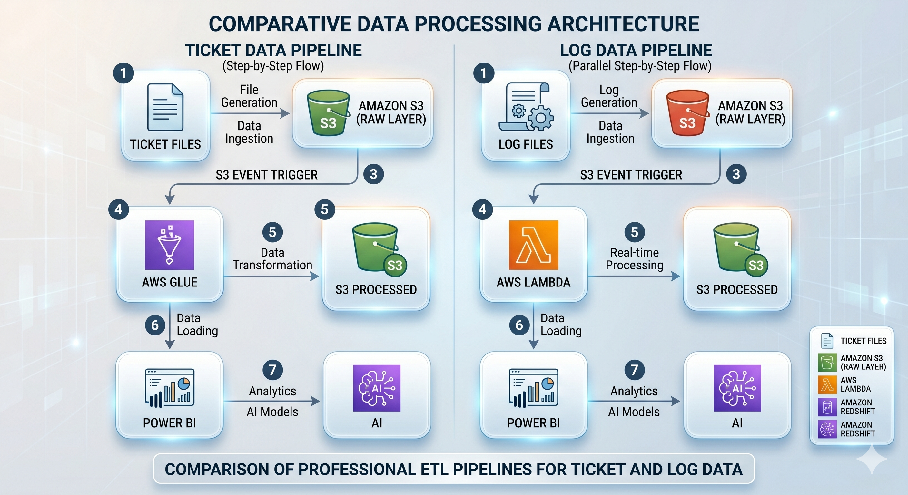

# Automated AWS ETL Pipeline 

## Project Overview

This project implements a fully automated cloud-based ETL pipeline for processing support ticket and log datasets using AWS services.

Two separate ingestion workflows were designed:

- Ticket files are processed using AWS Glue (used in this project for demonstration purposes).
- Log files are processed using AWS Lambda.

Whenever a new raw file is uploaded into Amazon S3, event-based triggers automatically initiate the ETL workflow.

The transformed data is stored in Amazon Redshift for warehousing and analytics, and Power BI is connected to Redshift for dashboard visualization and reporting.

---

# Architecture Workflow

## 1. Raw Data Ingestion

Incoming ticket and log files are uploaded into the raw layer of the Amazon S3 data lake.

### Example S3 Structure

```text
s3://support-ticket-pipeline/raw/tickets/
s3://support-ticket-pipeline/raw/logs/
```

---

## 2. Data Transformation Layer

### Ticket Processing Pipeline

- AWS Glue is used for ticket data transformation and ETL processing.
- Glue jobs automatically clean and transform ticket datasets.
- S3 event triggers initiate the Glue ETL workflow.
- AWS Lambda can also be used for implementing similar ticket processing workflows.

### Log Processing Pipeline

- AWS Lambda functions are used for real-time log data processing.
- Lambda functions are automatically triggered when new log files are uploaded into S3.
- The logs are processed and transformed dynamically.

---

## 3. Processed Data Layer

After transformation, the processed datasets are stored back into the processed layer of the same S3 data lake.

### Example Processed Structure

```text
s3://support-ticket-pipeline/processed/tickets/
s3://support-ticket-pipeline/processed/logs/
```

---

## 4. Data Warehousing

The transformed and processed datasets are loaded into Amazon Redshift.

Amazon Redshift acts as the centralized data warehouse for analytics and reporting.

---

## 5. Analytics and Visualization

Power BI is connected to Amazon Redshift to create dashboards and analytical reports for support ticket and log analysis.

---

## Optional Analytics Layer

Amazon Athena can optionally be used for ad-hoc analysis directly on datasets stored in Amazon S3.

This component is included in the architecture design but was not demonstrated or implemented in this project.

---

# Automation Features

This project implements a fully automated event-driven ETL workflow using:

- Amazon S3 Event Triggers
- AWS Glue Jobs
- AWS Lambda Functions
- IAM Roles and Permissions
- Automated Data Processing Pipelines

As soon as a raw file is ingested into Amazon S3, the pipeline automatically performs:

1. Data Extraction  
2. Data Transformation  
3. Data Loading  
4. Data Warehousing  

without manual intervention.

---

# Technologies Used

- Amazon S3
- AWS Glue
- AWS Lambda
- Amazon Redshift
- Amazon Athena
- Power BI
- IAM Roles
- CloudWatch
- Python
- SQL

---

# Project Highlights

- Automated ETL workflow
- Event-driven cloud architecture
- Separate pipelines for tickets and logs
- Serverless data processing
- Centralized cloud data warehouse
- Real-time and batch processing integration
- Dashboard visualization with Power BI

---

# Sample Architecture Flow
# Automated AWS ETL Pipeline for Support Ticket Analytics

## Project Overview

This project implements a fully automated cloud-based ETL pipeline for processing support ticket and log datasets using AWS services.

Two separate ingestion workflows were designed:

- Ticket files are processed using AWS Glue (used in this project for demonstration purposes).
- Log files are processed using AWS Lambda.

Whenever a new raw file is uploaded into Amazon S3, event-based triggers automatically initiate the ETL workflow.

The transformed data is stored in Amazon Redshift for warehousing and analytics, and Power BI is connected to Redshift for dashboard visualization and reporting.

---

# Architecture Workflow

## 1. Raw Data Ingestion

Incoming ticket and log files are uploaded into the raw layer of the Amazon S3 data lake.

### Example S3 Structure

```text
s3://support-ticket-pipeline/raw/tickets/
s3://support-ticket-pipeline/raw/logs/
```

---

## 2. Data Transformation Layer

### Ticket Processing Pipeline

- AWS Glue is used for ticket data transformation and ETL processing.
- Glue jobs automatically clean and transform ticket datasets.
- S3 event triggers initiate the Glue ETL workflow.
- AWS Lambda can also be used for implementing similar ticket processing workflows.

### Log Processing Pipeline

- AWS Lambda functions are used for real-time log data processing.
- Lambda functions are automatically triggered when new log files are uploaded into S3.
- The logs are processed and transformed dynamically.

---

## 3. Processed Data Layer

After transformation, the processed datasets are stored back into the processed layer of the same S3 data lake.

### Example Processed Structure

```text
s3://support-ticket-pipeline/processed/tickets/
s3://support-ticket-pipeline/processed/logs/
```

---

## 4. Data Warehousing

The transformed and processed datasets are loaded into Amazon Redshift.

Amazon Redshift acts as the centralized data warehouse for analytics and reporting.

---

## 5. Analytics and Visualization

Power BI is connected to Amazon Redshift to create dashboards and analytical reports for support ticket and log analysis.

---

## Optional Analytics Layer

Amazon Athena can optionally be used for ad-hoc analysis directly on datasets stored in Amazon S3.

This component is included in the architecture design but was not demonstrated or implemented in this project.

---

# Automation Features

This project implements a fully automated event-driven ETL workflow using:

- Amazon S3 Event Triggers
- AWS Glue Jobs
- AWS Lambda Functions
- IAM Roles and Permissions
- Automated Data Processing Pipelines

As soon as a raw file is ingested into Amazon S3, the pipeline automatically performs:

1. Data Extraction  
2. Data Transformation  
3. Data Loading  
4. Data Warehousing  

without manual intervention.

---

# Technologies Used

- Amazon S3
- AWS Glue
- AWS Lambda
- Amazon Redshift
- Amazon Athena
- Power BI
- IAM Roles
- CloudWatch
- Python
- SQL

---

# Project Highlights

- Automated ETL workflow
- Event-driven cloud architecture
- Separate pipelines for tickets and logs
- Serverless data processing
- Centralized cloud data warehouse
- Real-time and batch processing integration
- Dashboard visualization with Power BI

---

# Sample Architecture Flow

# Automated AWS ETL Pipeline for Support Ticket Analytics

## Project Overview

This project implements a fully automated cloud-based ETL pipeline for processing support ticket and log datasets using AWS services.

Two separate ingestion workflows were designed:

- Ticket files are processed using AWS Glue (used in this project for demonstration purposes).
- Log files are processed using AWS Lambda.

Whenever a new raw file is uploaded into Amazon S3, event-based triggers automatically initiate the ETL workflow.

The transformed data is stored in Amazon Redshift for warehousing and analytics, and Power BI is connected to Redshift for dashboard visualization and reporting.

---

# Architecture Workflow

## 1. Raw Data Ingestion

Incoming ticket and log files are uploaded into the raw layer of the Amazon S3 data lake.

### Example S3 Structure

```text
s3://support-ticket-pipeline/raw/tickets/
s3://support-ticket-pipeline/raw/logs/
```

---

## 2. Data Transformation Layer

### Ticket Processing Pipeline

- AWS Glue is used for ticket data transformation and ETL processing.
- Glue jobs automatically clean and transform ticket datasets.
- S3 event triggers initiate the Glue ETL workflow.
- AWS Lambda can also be used for implementing similar ticket processing workflows.

### Log Processing Pipeline

- AWS Lambda functions are used for real-time log data processing.
- Lambda functions are automatically triggered when new log files are uploaded into S3.
- The logs are processed and transformed dynamically.

---

## 3. Processed Data Layer

After transformation, the processed datasets are stored back into the processed layer of the same S3 data lake.

### Example Processed Structure

```text
s3://support-ticket-pipeline/processed/tickets/
s3://support-ticket-pipeline/processed/logs/
```

---

## 4. Data Warehousing

The transformed and processed datasets are loaded into Amazon Redshift.

Amazon Redshift acts as the centralized data warehouse for analytics and reporting.

---

## 5. Analytics and Visualization

Power BI is connected to Amazon Redshift to create dashboards and analytical reports for support ticket and log analysis.

---

## Optional Analytics Layer

Amazon Athena can optionally be used for ad-hoc analysis directly on datasets stored in Amazon S3.

This component is included in the architecture design but was not demonstrated or implemented in this project.

---

# Automation Features

This project implements a fully automated event-driven ETL workflow using:

- Amazon S3 Event Triggers
- AWS Glue Jobs
- AWS Lambda Functions
- IAM Roles and Permissions
- Automated Data Processing Pipelines

As soon as a raw file is ingested into Amazon S3, the pipeline automatically performs:

1. Data Extraction  
2. Data Transformation  
3. Data Loading  
4. Data Warehousing  

without manual intervention.

---

# Technologies Used

- Amazon S3
- AWS Glue
- AWS Lambda
- Amazon Redshift
- Amazon Athena
- Power BI
- IAM Roles
- CloudWatch
- Python
- SQL

---

# Project Highlights

- Automated ETL workflow
- Event-driven cloud architecture
- Separate pipelines for tickets and logs
- Serverless data processing
- Centralized cloud data warehouse
- Real-time and batch processing integration
- Dashboard visualization with Power BI

---

# Sample Architecture Flow
## Architecture Diagram

